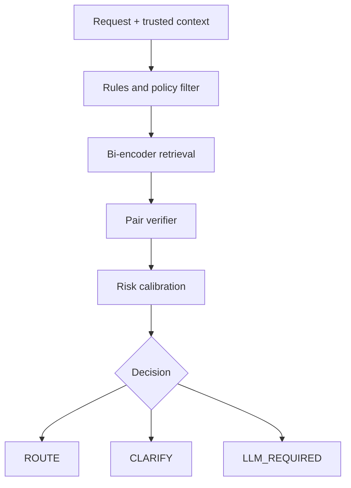

# FlowRoute

[](https://pypi.org/project/flowroute/)
[](https://github.com/open-first/FlowRoute/actions/workflows/ci.yml)
[](https://open-first.github.io/FlowRoute/)
[](https://www.python.org/downloads/)
[](LICENSE)

FlowRoute is a small, safety-oriented router that maps a natural-language request to a
deterministic workflow without using a generative LLM for the routing decision.

It returns exactly one of three outcomes:

- `ROUTE`: one eligible workflow clears its risk threshold;
- `CLARIFY`: the capability matches, but required input is missing; or
- `LLM_REQUIRED`: the request is unsupported, ambiguous, reasoning-heavy, or below threshold.

FlowRoute never executes workflows. Authorization, argument validation, confirmation,
idempotency, and side effects remain in the workflow orchestrator.

**[Read the documentation](https://open-first.github.io/FlowRoute/)** ·
[Quick start](#quick-start) ·
[Production mode](#production-mode)

## When FlowRoute fits

Use FlowRoute when:

- workflows are narrow, named, and deterministic;
- users express the same intent in varied language;
- a safe fallback is available for ambiguous requests;
- inference cost or latency matters; and
- false routing is more expensive than abstention.

Use an LLM or planner when the task requires explanation, advice, strategy, open-ended
generation, or several dependent actions. FlowRoute is a selector, not an orchestrator, an agent
framework, or a general-purpose intent classifier; its job is to decide whether a request belongs
to a known workflow and to abstain when it does not.

## Status

Version 0.2 provides a **production-hardened routing runtime and research scaffold**, but it does
not include a released model checkpoint. The default indexed TF-IDF retriever and lexical verifier
are development baselines. Production mode rejects them.

Production startup requires trained backends, a matching and approved artifact manifest, local
checkpoint hashes, a production-safe catalog, calibrated thresholds, and an injected
authorization callback. Model quality still depends on representative data and workflow-disjoint
evaluation; the demo fixtures are not evidence of real-world accuracy.

## Architecture



Each stage may only narrow the candidate set. Retrieval proposes; the verifier judges one
request-contract pair at a time; calibration decides whether the best candidate clears the risk
tier it was assigned. Schema completeness is deterministic and can override an unsafe prediction.

## Quick start

Requires Python 3.10 or newer.

```bash
python -m venv .venv
source .venv/bin/activate
pip install flowroute
```

The demo catalog is not shipped inside the package. Fetch it from the tagged source:

```bash
curl -O https://raw.githubusercontent.com/open-first/FlowRoute/v0.2.0/examples/workflows.yaml

flowroute route \
  --catalog workflows.yaml \
  --text "Where is order 4812?" \
  --debug
```

Expected decision:

```json
{
  "decision": "ROUTE",
  "workflow_id": "orders.get_status",
  "reason_code": "ACCEPTED_LOW_RISK"
}
```

Run the local fixture suite:

```bash
flowroute evaluate \
  --catalog examples/workflows.yaml \
  --calibration configs/calibration.yaml \
  --data examples/requests.jsonl \
  --fail-on-error
```

The fixture suite reads files from the repository, so clone it first:

```bash
git clone https://github.com/open-first/FlowRoute.git && cd FlowRoute
```

Run unit tests without installing development tools:

```bash
PYTHONPATH=src python -m unittest discover -s tests -v
```

## Documentation

The complete developer guide is published at
**[open-first.github.io/FlowRoute](https://open-first.github.io/FlowRoute/)**. It covers
installation, contracts, Python, HTTP and CLI integration, routing internals, training, dataset
design, evaluation, safety, production requirements, and troubleshooting.

The source is portable Markdown under `docs/`, configured for MkDocs:

```bash
pip install -r requirements-docs.txt
mkdocs serve
```

Build a static site that can be uploaded to any static host:

```bash
mkdocs build --strict
```

## Python API

```python
from flowroute import FlowRouter, RouteRequest, WorkflowRegistry

registry = WorkflowRegistry.from_yaml("examples/workflows.yaml")
router = FlowRouter(registry)

result = router.route(
    RouteRequest(
        text="Cancel my design review tomorrow at 3 PM",
        context={"event_id": "evt_123"},
    )
)

print(result.decision)      # ROUTE
print(result.workflow_id)   # calendar.cancel_event
```

An empty `allowed_workflow_ids` list means no workflows are allowed. Omitting the field means all
otherwise eligible workflows may be considered.

## HTTP API

```bash
pip install "flowroute[api]"
flowroute serve --catalog workflows.yaml --port 8000
```

```bash
curl -s http://127.0.0.1:8000/v1/route \
  -H 'content-type: application/json' \
  -d '{
    "text": "Cancel my design review tomorrow at 3 PM",
    "context": {"event_id": "evt_123"},
    "catalog_version": "demo-2026-09-04"
  }'
```

The development service also exposes `GET /health`, `GET /health/live`, and
`GET /health/ready`. A stale `catalog_version` returns HTTP 409.

## Workflow contracts

Contracts describe capability boundaries, inputs, effects, and risk—not executable code.

```yaml
- id: calendar.cancel_event
  version: 1.0.0
  name: Cancel a calendar event
  description: Cancel one existing event the current user may modify.
  positive_capabilities:
    - cancel an existing meeting
  exclusions:
    - decline an invitation
    - delete a recurring series without confirmation
  required_inputs:
    - name: event_id
      pattern: '\b(?P<value>evt_[A-Za-z0-9_-]+)\b'
  side_effect: external_write
  risk_tier: medium
  confirmation: required_if_recurring
```

For safety, external or destructive contracts must declare both exclusions and a confirmation
policy. Regex extraction is optional; trusted structured context takes precedence.

## Production mode

```python
from flowroute import LoggingTelemetrySink, load_production_router
from flowroute.api import ApiSettings, create_app

router = load_production_router(
    catalog_path="/config/workflows.yaml",
    calibration_path="/config/calibration.yaml",
    artifact_manifest_path="/config/artifact-manifest.yaml",
    retriever_model="/models/retriever",
    verifier_model="/models/verifier",
    telemetry=LoggingTelemetrySink(),
)

async def authorize(request, payload):
    principal = request.scope["authenticated_principal"]
    return await permission_service.allowed_workflow_ids(principal)

app = create_app(
    router,
    authorizer=authorize,
    settings=ApiSettings.production_defaults(
        trusted_hosts=["router.example.internal"],
    ),
)
```

Production mode:

- verifies catalog, model, serializer, calibration, policy, prefix, label-order, and top-K lineage;
- hashes local model directories before loading;
- requires catalog version and an authorization-derived workflow allowlist on every request;
- disables caller-supplied exact-event shortcuts unless explicitly approved for a trusted entrypoint;
- disables debug candidate exposure;
- checks artifact compatibility again before every request;
- time-bounds regex extraction and limits request/context sizes;
- fails closed on backend errors;
- batches verifier inference;
- emits privacy-conscious structured telemetry; and
- supports atomic bundle reload and rollback through `RouterRuntime`.

See [Production mode](https://open-first.github.io/FlowRoute/operations/production-mode/) and
[Artifact manifests](https://open-first.github.io/FlowRoute/operations/artifact-manifests/).

## Plug in Hugging Face checkpoints

Install the ML extra:

```bash
pip install "flowroute[hf]"
```

```python
from flowroute import FlowRouter, WorkflowRegistry
from flowroute.backends import HuggingFaceCrossEncoderVerifier, HuggingFaceRetriever

registry = WorkflowRegistry.from_yaml("examples/workflows.yaml")
router = FlowRouter(
    registry,
    retriever=HuggingFaceRetriever("your-account/flowroute-retriever"),
    verifier=HuggingFaceCrossEncoderVerifier("your-account/flowroute-verifier"),
)
```

The verifier checkpoint must output logits in this order by default:
`mismatch`, `needs_input`, `executable`. Schema completeness remains deterministic and can override
an unsafe `executable` prediction.

## Train the first retriever

The `training/` directory contains:

- a deterministic demo-data builder;
- a current Sentence Transformers trainer entry point;
- a Transformers three-class verifier entry point; and
- model/dataset card templates with explicit `TBD` fields.

These scripts ship only in the repository, so run them from a clone:

```bash
PYTHONPATH=src python training/build_demo_data.py \
  --catalog examples/workflows.yaml \
  --output-dir artifacts/demo-data

pip install -e ".[training]"
python training/train_retriever.py \
  --data artifacts/demo-data/retriever.jsonl \
  --output-dir models/flowroute-retriever
```

Do not publish the demo-derived checkpoint as a research result. Build workflow-disjoint train,
calibration, and hidden test splits first.

## Repository map

```text
src/flowroute/          routing library, CLI, and optional HTTP API
src/flowroute/backends/ optional Hugging Face adapters
examples/               demo catalog and labeled requests
configs/                baseline threshold bundle
training/               data and model-training scaffolds
tests/                  unit and end-to-end safety tests
docs/                   architecture and research implementation notes
```

## Before publishing a model release

1. Add the final repository URLs to package metadata after the public repository URL exists.
2. Audit dataset and base-model licenses.
3. Freeze workflow-disjoint splits before augmentation.
4. Train and evaluate at least the retriever and verifier baselines.
5. Fit calibration by risk tier on a separate split.
6. Report false-route rate together with route coverage and confidence intervals.
7. Fill every `TBD` in the model and dataset cards; publish checkpoint hashes.

## Contributing

Contributions are welcome. [CONTRIBUTING.md](CONTRIBUTING.md) states the rules that protect the
safety boundary: keep the router separate from workflow execution; add a regression test for every
routing or abstention change; never weaken a risk threshold to make one example pass; and do not
add benchmark numbers without a reproducible evaluation artifact.

`main` is protected. Work on a branch and open a pull request; CI must pass on Python 3.10 and
3.12, and documentation changes must also survive `mkdocs build --strict`.

## Security

Do not open a public issue for a suspected vulnerability. Use GitHub's private
vulnerability-reporting feature, or follow [SECURITY.md](SECURITY.md).

## Citation

If you use FlowRoute in research, cite the software through [CITATION.cff](CITATION.cff). GitHub
renders a ready-made citation from that file under **Cite this repository**.

## License

Apache-2.0. Dataset and model artifacts may have separate licenses; document them before release.
